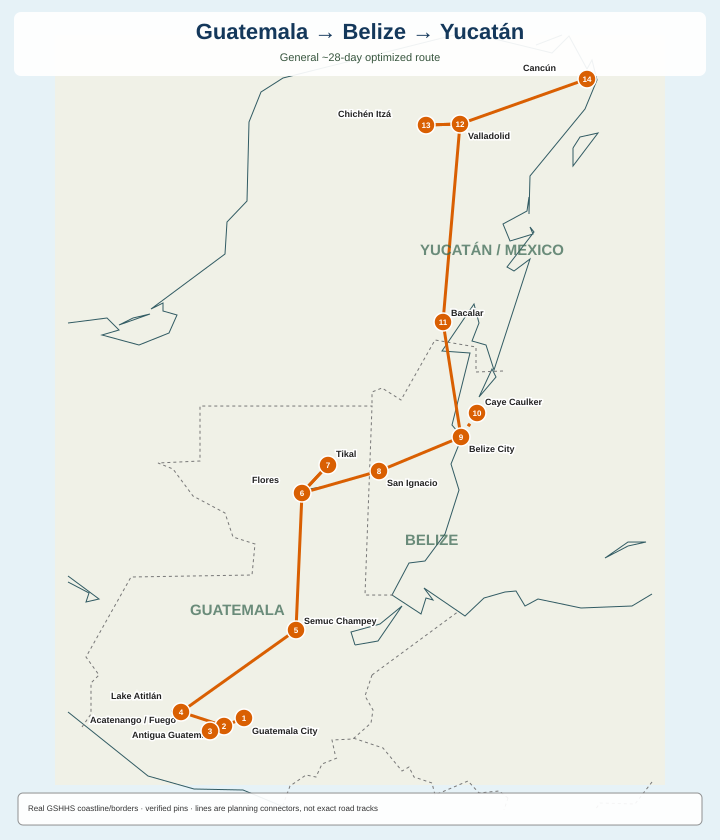
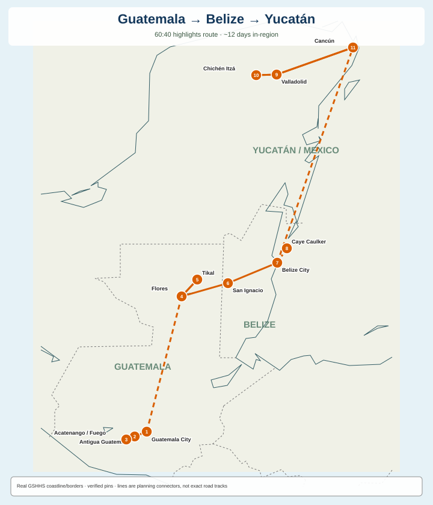

# Guatemala → Belize → Mexico — optimized route research

A researched, route-optimized travel plan for **Guatemala → Belize → Yucatán**, built around a general **~28-day first-trip route**, a separate **60:40 highlights route**, and a concrete **February 1–28, 2027 booking example**.

Research snapshot: **2026-08-23**.

> Prices, schedules, border procedures, opening hours, volcanic conditions and weather can change. Flight prices in this folder are snapshots, not guarantees; transport durations are planning estimates and should be rechecked before booking.

## Real geographic maps

These maps are **programmatically rendered from verified coordinates and real GSHHS coastlines/country borders**. They are not AI-generated geography.



**Full route:** Europe → Guatemala City → Antigua → Acatenango/Fuego → Lake Atitlán → Semuc Champey → Flores → Tikal (+ optional Yaxhá) → San Ignacio → Belize City transit → Caye Caulker → Bacalar → Valladolid → Chichén Itzá (+ optional Ek Balam) → Cancún → Europe.

Optional end extension: **Cancún → Mexico City → Europe** when time or airfare makes it worthwhile.



The 60:40 route uses strategic **GUA→FRS** and **BZE→CUN** flights to retain roughly **63% of the scored experience value in ~43% of the full-route time** instead of spending short-trip days on long detours.

Map data and output files live under [`maps/`](./maps/). The **SVG is the final static artifact and is committed directly to GitHub** together with its GeoJSON source data. The saved route lines are planning connectors between verified stop coordinates, **not claimed road-centerline GPS tracks**; see [`maps/README-map-method.md`](./maps/README-map-method.md).

The reusable generator is kept outside itinerary data at [`../../tools/python/script.py`](../../tools/python/script.py). Run it from the repo root with:

```bash
python tools/python/script.py itineraries/Central-America-Guatemala-Belize-Mexico
```

There is also an **OpenStreetMap-backed interactive source map** in [`maps/interactive-map.html`](./maps/interactive-map.html), using Leaflet + OSM tiles and toggles for the full and 60:40 routes.

---

## Best general ~28-day route

| Days | Base / move | Main focus |
|---|---|---|
| 1–5 | Antigua + Acatenango | UNESCO Antigua, Acatenango/Fuego 2D/1N, recovery/weather buffer |
| 6–8 | Lake Atitlán | San Juan + another village + slower lake day |
| 9–11 | Semuc Champey | long transfer, mirador + pools, transfer to Flores |
| 12–14 | Petén | Tikal, optional Yaxhá, Flores→Belize |
| 15–17 | San Ignacio / Cayo | ATM Cave, Xunantunich/Cahal Pech, optional Caracol/Mountain Pine Ridge |
| 18–21 | Caye Caulker | Hol Chan/Shark Ray Alley, Blue Hole/Lighthouse Reef option, weather buffer |
| 22–23 | Bacalar | border transfer + Lagoon of Seven Colors |
| 24–27 | Valladolid / Yucatán | Valladolid, Chichén Itzá + cenote, optional Ek Balam, Cancún transfer |
| 28 | Cancún | fly home |

Full day-by-day logic: **[`general-28-day-route.md`](./general-28-day-route.md)** / **[`itinerary-28-days.md`](./itinerary-28-days.md)**.

### Why this order wins

1. **No Atitlán→Guatemala City backtrack** in the full route: continue toward Lanquín/Semuc.
2. **Belize City is transit**, not a forced overnight: San Ignacio→Belize City→Caye Caulker fits one travel day.
3. **Bacalar fixes the worst overland bottleneck**: instead of a roughly 10-hour Caye Caulker→Valladolid chain, it creates two manageable legs and adds a genuinely strong lagoon destination.
4. **Valladolid beats Cancún as the Chichén Itzá base** and also places Ek Balam nearby.
5. **Cancún stays short**: excellent international endpoint and beach buffer, but not where the route earns its highest sightseeing value.
6. **Mexico City stays optional**: add it only when you have 2–4 extra days or the return-fare structure makes it worthwhile.

---

## 60:40 highlights route — ~12 days in-region

**Goal:** preserve roughly the best 60% of the experience value in only about 40% of the time.

**Route:** GUA → Antigua → Acatenango/Fuego → GUA → **fly FRS** → Tikal → San Ignacio → ATM Cave → Belize City → Caye Caulker → Hol Chan/Shark Ray Alley → BZE → **fly CUN** → Valladolid → Chichén Itzá → Cancún.

### What it deliberately cuts

- Lake Atitlán by default;
- Semuc Champey;
- Yaxhá;
- Caracol/Mountain Pine Ridge;
- Great Blue Hole by default;
- Bacalar;
- Ek Balam;
- Mexico City.

Those are not bad sights. They lose because their **time/detour cost is too high under a ~12-day constraint**.

### Experiences protected at almost any cost

1. **Acatenango/Fuego**
2. **Tikal**
3. **ATM Cave**
4. **Hol Chan + Shark Ray Alley**
5. **Chichén Itzá**

Detailed schedule + cut logic: **[`itinerary-60-40.md`](./itinerary-60-40.md)**.

---

## Best season

For this exact combination of volcano views, overland travel, reef days and archaeology:

| Season tier | Months | Verdict |
|---|---|---|
| **S** | **February, March** | best all-round balance |
| **A** | January, December, April | excellent; Jan/Dec cooler/windier, Apr hotter |
| **B** | November | good shoulder-season candidate |
| **C** | May, July, August | possible, but wetter/humid and less reliable |
| **D/F** | June, September, October | weakest for a once-a-year trip; September is worst overall |

February scores **9.7/10** for the route in the planning matrix. See **[`weather-and-timing.md`](./weather-and-timing.md)** for every destination/month score and activity-specific reasoning.

---

## February 2027 worked booking example

The date-specific itinerary is kept separate so temporary fares do not contaminate the evergreen route design.

**Reference dates:** **Feb 1–28, 2027**.

Indicative Skyscanner snapshot:

- **BUD→GUA Feb 1: ~€453**
- **VIE→GUA Feb 1: ~€472**
- **CUN→BUD Feb 28: ~€358**
- **CUN→VIE Feb 26: ~€400**

### Current raw airfare winner

**BUD→GUA + CUN→BUD ≈ €811** long-haul airfare.

### Current practical favorite from Vienna

**VIE→GUA + CUN→BUD ≈ €830** — only ~€19 more airfare and it removes the outbound Vienna→Budapest positioning leg, so it can be better door-to-door.

See **[`booking-example-2027-02.md`](./booking-example-2027-02.md)** and the full dated schedule in **[`itinerary.md`](./itinerary.md)**.

Skyscanner attribution: https://skyscanner.net/g/referrals/v1/flights/home?mediaPartnerId=2850210&utm_term=skyscanner_chatgpt_app_data

---

## Major transport bottlenecks

| Leg | Planning result | Route decision |
|---|---|---|
| Semuc → Flores | ~7h20 bus / ~8h shuttle | accept as full transfer day only in long route |
| Flores → San Ignacio | ~2h30 transport + border buffer | efficient international land crossing |
| San Ignacio → Belize City | ~2–2.5h | continue same day to Caye Caulker |
| Belize City → Caye Caulker | ~45m ferry | no Belize City overnight by default |
| Caye Caulker → Valladolid | ~10h chain | avoid in full route by stopping Bacalar |
| Caye Caulker → Bacalar | fastest overview ~5h12 | useful full-route split |
| Bacalar → Valladolid | ~4h44 | manageable second leg |
| Caye Caulker → Cancún | fly ~4h43 overall vs ~9h21 ferry+train | use flight only for 60:40/time-first version |

Detailed mode logic: **[`transport-and-route-optimization.md`](./transport-and-route-optimization.md)**.

---

## Highest-value sights

The route's normalized sight model is stored in **[`data/sights.csv`](./data/sights.csv)**.

Top tier:

1. Acatenango/Fuego overnight — **S / 10**
2. Tikal — **S / 10**
3. ATM Cave — **S / 10**
4. Hol Chan + Shark Ray Alley — **S / 10**
5. Chichén Itzá — **S / 10**
6. Lake Atitlán — **A / 9**
7. Antigua — **A / 9**
8. Caye Caulker / reef base — **A / 9**
9. Bacalar — **A / 9**
10. Xunantunich — **A / 9**
11. Semuc Champey — **A / 8.5**

Full descriptions, time costs and cut logic: **[`sights.md`](./sights.md)**.

---

## Optional variants

Use **[`optional-variants.md`](./optional-variants.md)** for:

- relaxed ~28 days;
- maximum sightseeing 30–32 days;
- budget route;
- hiking/nature-heavy route;
- archaeology-heavy route;
- reef/beach-heavy route;
- Mexico City ending;
- El Paredón surf detour;
- 60:40/high-speed version.

---

## Repository contents

```text
TravelRoutes/
├── prompt.md
├── map-generation.md
├── tools/
│   └── python/
│       └── script.py                  # reusable SVG map generator
└── itineraries/
    └── Central-America-Guatemala-Belize-Mexico/
        ├── README.md
        ├── general-28-day-route.md
        ├── itinerary-28-days.md
        ├── itinerary-60-40.md
        ├── itinerary.md               # detailed Feb 1–28, 2027 schedule
        ├── booking-example-2027-02.md
        ├── sights.md
        ├── weather-and-timing.md
        ├── transport-and-flights.md
        ├── transport-and-route-optimization.md
        ├── flights.md
        ├── optional-variants.md
        ├── sources-and-images.md
        ├── sources.md
        ├── data/
        │   └── sights.csv
        └── maps/
            ├── map-full-route.svg     # committed vector map
            ├── map-60-40-route.svg    # committed vector map
            ├── stops.geojson
            ├── route.geojson
            ├── route-60-40.geojson
            ├── interactive-map.html
            └── README-map-method.md
```

## Source policy

Primary sources are preferred for factual claims: UNESCO, Smithsonian Global Volcanism Program, Belize Tourism/National Meteorological Service, Yucatán/Mexico tourism authorities and transport operators. Rome2Rio is used for route-mode comparisons; Skyscanner for indicative airfare research.

See **[`sources.md`](./sources.md)** for the structured research trail and **[`sources-and-images.md`](./sources-and-images.md)** for the earlier visual/article research collection.
