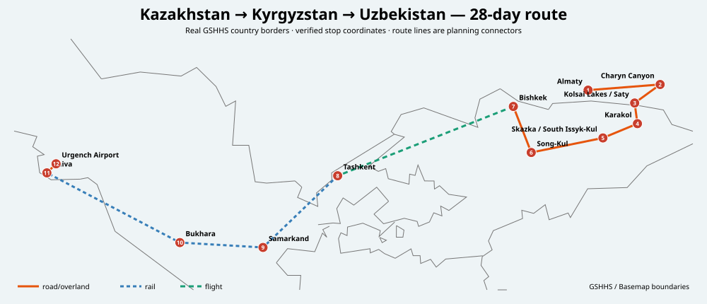
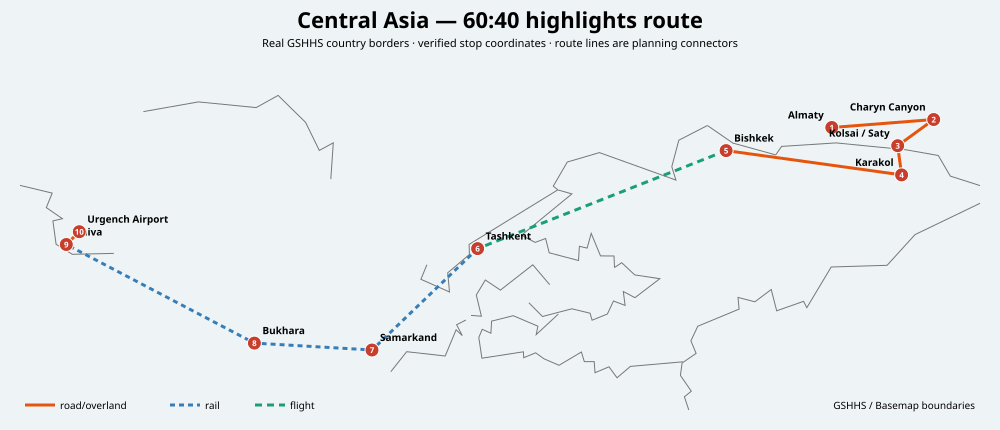

# Central Asia: Kazakhstan → Kyrgyzstan → Uzbekistan

**Recommended length:** 28 days  
**Best of July/August/September:** **September**, ideally roughly **1–28 September**.  
**Core countries:** Kazakhstan, Kyrgyzstan, Uzbekistan.  
**Tajikistan:** optional extension only; not in the core safety-first route because Austria currently rates parts of the country at level 3 and the rest at level 2.  
**Turkmenistan:** excluded from the core because access/visa logistics add friction and it does not improve this one-month route enough.

## Optimized route

**Fly into Almaty → Charyn → Kolsai/Saty → cross to Karakol → south shore Issyk-Kul → Song-Kul → Bishkek → fly to Tashkent → Samarkand → Bukhara → Khiva → fly home via Urgench/Tashkent.**

This order keeps the best mountain weather first, avoids dragging overland across Kazakhstan's huge distances, and puts the hottest Uzbek desert cities later in September when conditions improve. The Bishkek→Tashkent flight is a deliberate time-buy: Rome2Rio currently shows the bus around 12h40, while driving is about 8h43 and air options can save most of a day.

## Why these three “-stans”

- **Kazakhstan:** Austria BMEIA safety level 1; easiest safety profile of the region.
- **Kyrgyzstan:** level 2; excellent mountain value and a natural overland continuation from southeast Kazakhstan.
- **Uzbekistan:** level 2; strongest Silk Road city cluster, joined by fast rail.
- **Tajikistan:** level 2 generally, level 3 in GBAO and Afghanistan-border areas; good optional extension but not necessary for a first safety-first month.

## Quick day split

| Segment | Nights / days | Main value |
|---|---:|---|
| Almaty + SE Kazakhstan | 6 | city, Charyn, Kolsai/Kaindy, Tian Shan |
| Kyrgyzstan | 10 | Karakol hikes, Issyk-Kul, yurts, Song-Kul, Bishkek |
| Uzbekistan | 12 | Tashkent, Samarkand, Bukhara, Khiva |

## 60:40 route

12 days: **Almaty (2) → Charyn/Kolsai (2) → Karakol (2) → Bishkek (1) → fly Tashkent (1) → Samarkand (2) → Bukhara (1) → Khiva (1)**. It preserves roughly 65–70% of the first-trip experience value by retaining the two strongest landscape clusters plus the three strongest Silk Road cities.

## Best season

Among the requested months: **September > August > July**. Early September is the compromise sweet spot: high Kyrgyz passes are generally still accessible, while Uzbekistan is noticeably less punishing than July/August. Late September can become cold at Song-Kul and on high hikes, so place the mountains in the first half.

## Transport bottlenecks

1. Kolsai/Saty → Karakol border logistics can be variable: confirm the intended crossing is open to foreigners before committing.
2. Song-Kul needs road transfers and often a 4×4 for the final approach; do not plan it as a tight same-day connection.
3. Bishkek → Tashkent is the one leg where a flight is usually worth the cost.
4. Uzbek rail: reserve Afrosiyob/high-speed seats early when dates open; Tashkent→Samarkand is about 2h13 in Rome2Rio's current route data, Samarkand→Bukhara about 2h40.
5. Bukhara→Khiva is about 6h47 by train in current Rome2Rio routing; an overnight or early train avoids losing a prime sightseeing day.

## Files

- [28-day route](general-28-day-route.md)
- [60:40 route](itinerary-60-40.md)
- [Transport optimization](transport-and-route-optimization.md)
- [Sights ranking](sights.md)
- [Weather/timing](weather-and-timing.md)
- [Safety and borders](safety-and-borders.md)
- [Booking example](booking-example-2027-09.md)
- [Sources](sources.md)
- [Sight data](data/sights.csv)
- [Interactive map](maps/interactive-map.html)

## Map method

Stops are stored as GeoJSON `[longitude, latitude]`; route lines preserve mode semantics. Static SVGs are generated with the repository-wide `tools/python/script.py` using Basemap/GSHHS borders and coastlines. The current route geometries are explicitly planning connectors rather than turn-by-turn road geometry.
