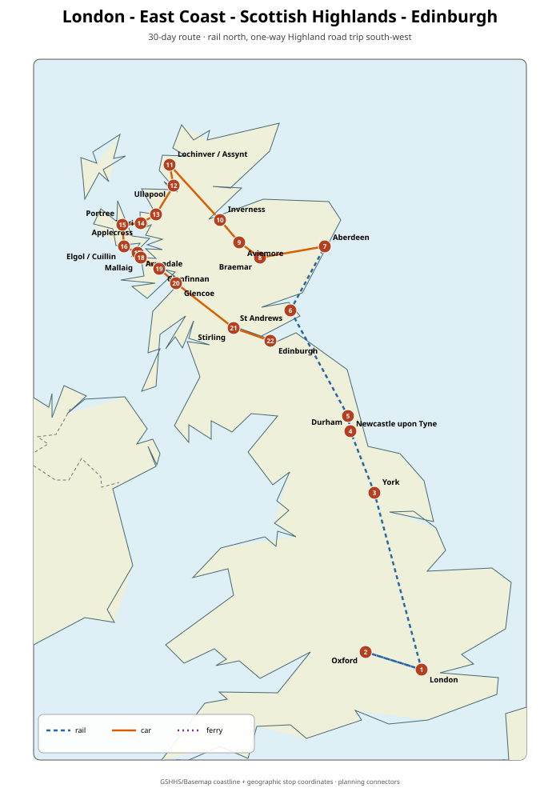
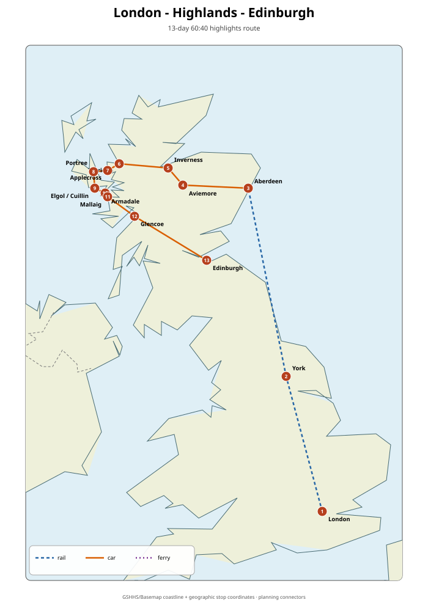

# London → East Coast cities → Scottish Highlands → Edinburgh

**Recommended first-trip duration:** 30 days  
**Best overall timing:** early to mid-September (best value/crowd balance); July is best for maximum daylight; August only wins if the Edinburgh festivals are a major goal.  
**Transport concept:** fly into London → rail north through high-value East Coast cities → pick up a one-way rental car in Aberdeen → Cairngorms / north-west Highlands / Skye / Glencoe → return car in Edinburgh → fly home.

## Optimized route

**London (with Oxford day trip) → York → Durham → Newcastle → St Andrews → Aberdeen → Royal Deeside → Cairngorms → Inverness → Assynt → Ullapool → Torridon → Applecross → Isle of Skye → Glenfinnan → Glencoe → Stirling → Edinburgh**

This order beats a city-hopping zig-zag because London–York and the north-east cities sit naturally on the East Coast rail corridor, while the rental car begins only where public transport stops being the best tool. Edinburgh is deliberately saved for the end so the road trip finishes naturally at a major airport instead of forcing a loop back to Aberdeen.

## Why not simply drive the full North Coast 500?

The NC500 is roughly 516 miles / 830 km and VisitScotland recommends at least 5–7 days. For a first visit, the north-east/north-coast section is weaker per driving hour than the combined **Assynt + Torridon + Applecross + Skye + Glencoe** chain. The full NC500 is therefore an extension, not the default.

## Duration decision

| Length | Verdict | What changes |
|---|---|---|
| 13 days | 60:40 sprint | London + York + selected Highlands + Skye + Glencoe + Edinburgh; intense |
| 24–25 days | Very good | Cut Newcastle full day, St Andrews overnight, one Assynt/Torridon day and one Skye day |
| **30 days** | **Sweet spot** | Best first-trip balance; enough weather buffers for hiking |
| 35–38 days | Excellent if time allows | Add Orkney **or** Lewis/Harris properly |
| 42+ days | Diminishing returns unless island-focused | Add both island groups, more hikes and slower weather buffers |

## 60:40 route

The condensed version takes **13 days (~43% of the full trip)** and is designed to preserve roughly **70–75% of the weighted experience value** by keeping London, York and the strongest Highland landscapes while deleting most medium-value city time and the long Assynt loop.

## Best season

- **September:** best overall balance. VisitScotland explicitly describes September as a sweet spot with mild temperatures, long daylight and quieter attractions. Midges remain possible through October but peak in mid-summer, especially in the west Highlands.
- **July:** best if hiking/daylight is the highest priority. Warmest conditions are typically July/August and daylight is longest, but summer demand is high.
- **August:** best only if you actively want the Fringe / International Festival / Military Tattoo atmosphere. Edinburgh becomes dramatically busier and more expensive; 2026’s major August festivals ran 7–31 August (Fringe) and 7–30 August (International Festival).

## Major must-see experiences

1. London core historic/museum days
2. Oxford university architecture
3. York Minster + medieval centre
4. Durham Cathedral
5. Dunnottar Castle
6. Cairngorms mountain/loch day
7. Assynt: Stac Pollaidh + west-coast scenery
8. Torridon hike
9. Bealach na Bà / Applecross
10. Skye: Quiraing, Storr, Cuillin/Elgol
11. Glenfinnan + Glencoe
12. Stirling Castle
13. Edinburgh Old Town + Arthur’s Seat

## Practical notes

- UK rail Advance tickets generally become available around 12 weeks ahead and are quota-limited. Book long LNER legs early once dates are fixed.
- If eligible for a 16–25 or 26–30 Railcard, compare it against the trip’s train spend; eligible Railcards typically give 1/3 off many fares.
- Austrian / EU visitors can drive in the UK with a non-UK licence; an IDP is not required for a normal visit under current GOV.UK guidance.
- Scotland drives on the left. Many Highland roads are single-track with passing places; never park in a passing place.
- Austrian passport holders currently require a UK ETA before travel.

## Files

- [30-day route](general-30-day-route.md)
- [60:40 route](itinerary-60-40.md)
- [Transport optimization](transport-and-route-optimization.md)
- [Flights](flights.md)
- [Sights and rankings](sights.md)
- [Weather and timing](weather-and-timing.md)
- [Optional variants](optional-variants.md)
- [Worked July 2027 booking shell](booking-example-2027-07.md)
- [Sources](sources.md)
- [Sight data CSV](data/sights.csv)
- [Interactive map](maps/interactive-map.html)

## Map method

The committed SVG is generated from real geographic place-centre coordinates stored in `maps/stops.geojson`. Route modes are encoded in GeoJSON. The current static route lines are explicitly **planning connectors**, not fake turn-by-turn road tracks. Rail, road and ferry segments are rendered differently, and the route remains reproducible from the committed data.

Research snapshot: **2026-08-24**.
