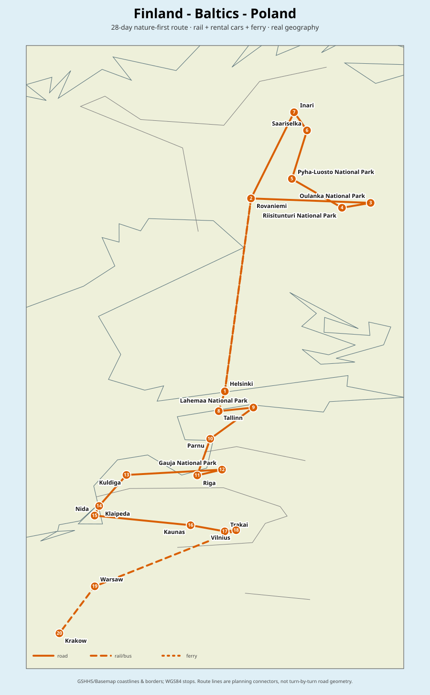
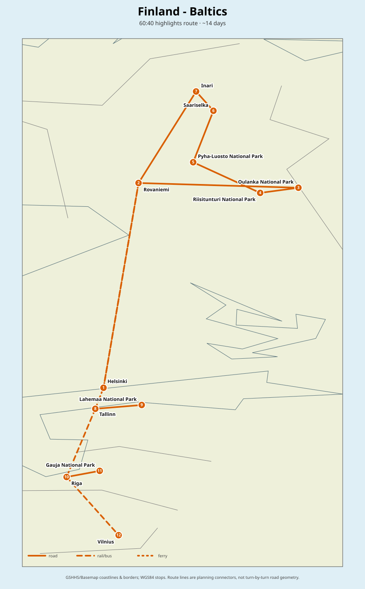

# Finland + Baltics + Poland — Summer Hammock Route

**Optimized route:** **Helsinki → night train to Rovaniemi → Oulanka → Riisitunturi → Pyhä-Luosto → Saariselkä / Urho Kekkonen NP → Inari → Rovaniemi → night train to Helsinki → ferry to Tallinn → Lahemaa → Pärnu → Riga → Gauja NP → Kuldīga → Klaipėda / Curonian Spit (Nida) → Kaunas → Trakai → Vilnius → Warsaw → Kraków**.

## Core recommendation
Do **not** rent a car in Helsinki and spend a full day grinding north. Use rail where rail is strongest, then rent a car where it actually unlocks wilderness.

- **Finland:** Helsinki + sleeper to Rovaniemi; 8–9 day Rovaniemi-loop rental car for the national parks and Inari.
- **Sleeping:** **hammock + tarp + bug net is the default**, car mainly as transport, gear storage and poor-weather fallback. In ordinary Finnish forest, temporary camping is broadly allowed under Everyman's Rights; national parks/protected areas can restrict camping, so local park rules win.
- **Baltics:** nature-first version uses a cross-border car **Tallinn → Vilnius**; solo/budget variant uses buses plus short local rentals.
- **Poland:** drop the Baltic car in Vilnius; continue overland to Warsaw and Kraków instead of paying a large cross-border/one-way fee.

## Why this is better than the rough plan
1. Avoids wasting a useful sightseeing day on Helsinki→Lapland motorway.
2. Concentrates Finnish driving on **Oulanka, Riisitunturi, Pyhä-Luosto, Saariselkä/UKK and Inari**.
3. The Baltic road leg adds bogs, coastline, sandstone valleys and Curonian dunes instead of just capitals.
4. Poland becomes a logical southbound finish rather than a detached extension.
5. Hammock camping fits the route unusually well: Finland, Estonia and Latvia are comparatively permissive; Lithuania and Poland need designated/legal sites.

## Best month
**August is the best all-round choice for this exact trip and hammock style.**

- **July:** warmest / brightest, but peak crowds and strongest mosquito pressure in Lapland.
- **August:** still summer, most mosquitoes fade later in the month, dark nights start returning, first ruska colours can appear late month — best balance.
- **September:** visually spectacular in Lapland and better for aurora, but hammock nights can approach/breach 0°C, so the sleep system must be genuinely warm.

**Sweet spot:** roughly **1–31 August** for easiest hammock comfort, or **10 August – 7 September** for fewer bugs + first darker nights.

## Recommended duration
- **Canonical route:** 28 days.
- **Comfortable:** 30–32 days.
- **60:40:** ~14 days.

### 60:40 map

## Hammock rules by country
| Country | Practical rule | Route recommendation |
|---|---|---|
| Finland | Temporary camping under Everyman's Rights where access is otherwise allowed; protected areas can restrict it. | **Excellent.** Ordinary forest or designated park sites. |
| Estonia | Freedom to roam generally allows one-night camping on unmarked/unfenced land unless prohibited; protected areas have separate rules. | **Excellent.** Prefer RMK sites around Lahemaa. |
| Latvia | LVM allows short-term overnighting in suitable forest locations subject to local/protected-area rules. | **Very good.** LVM forests/sites. |
| Lithuania | Current protected-area guidance is much stricter and directs overnighting to designated campsites/overnight sites. | **Designated sites.** |
| Poland | Use official **Zanocuj w lesie** zones; State Forests rules explicitly recommend hammocks. | **Mapped legal zones only.** |

## Files
- [28-day itinerary](itinerary-28-days.md)
- [60:40 route](itinerary-60-40.md)
- [Transport optimization](transport-and-route-optimization.md)
- [Hammock / overnighting guide](hammock-and-wild-camping.md)
- [Sights & scoring](sights.md)
- [Weather & timing](weather-and-timing.md)
- [Flights](flights.md)
- [Variants](optional-variants.md)
- [August 2027 booking layer](booking-example-2027-08.md)
- [Sources](sources.md)
- [Real full-route SVG](maps/map-full-route.svg)
- [Real 60:40 SVG](maps/map-60-40-route.svg)
- [Interactive OpenStreetMap](maps/interactive-map.html)
- [Stops GeoJSON](maps/stops.geojson)
- [Full route GeoJSON](maps/route.geojson)
- [60:40 route GeoJSON](maps/route-60-40.geojson)
- [Map configuration](maps/map-config.json)
- [Reusable map generator](../../tools/python/script.py)
- [Sight data](data/sights.csv)

## Map method
The SVG maps are built from WGS84 stop coordinates and real GSHHS/Basemap coastlines and borders. Route lines are explicit planning connectors unless exact routed geometry is available; ferry and rail/bus legs are encoded separately from road legs. The committed GeoJSON remains the source of truth so the SVGs are reproducible with the repository-wide generator.