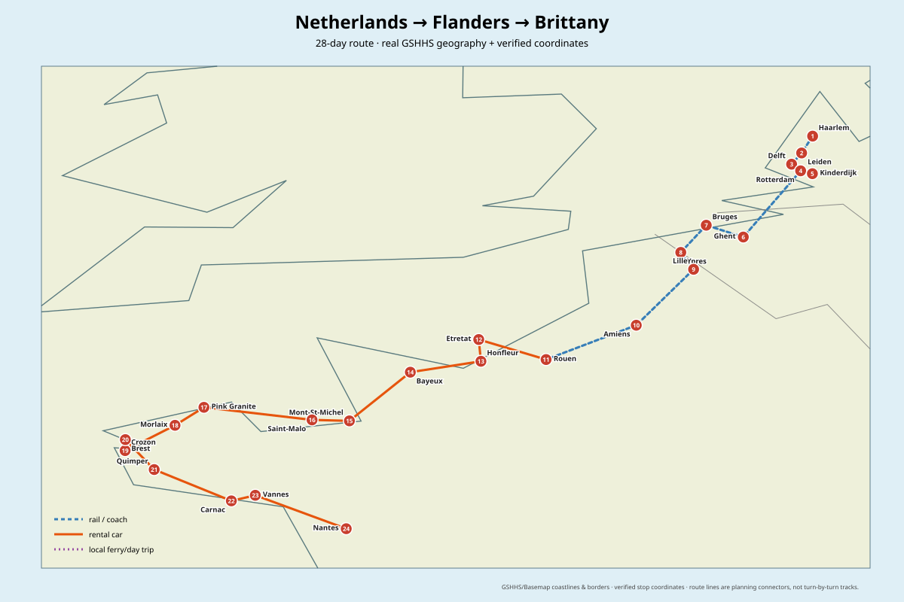
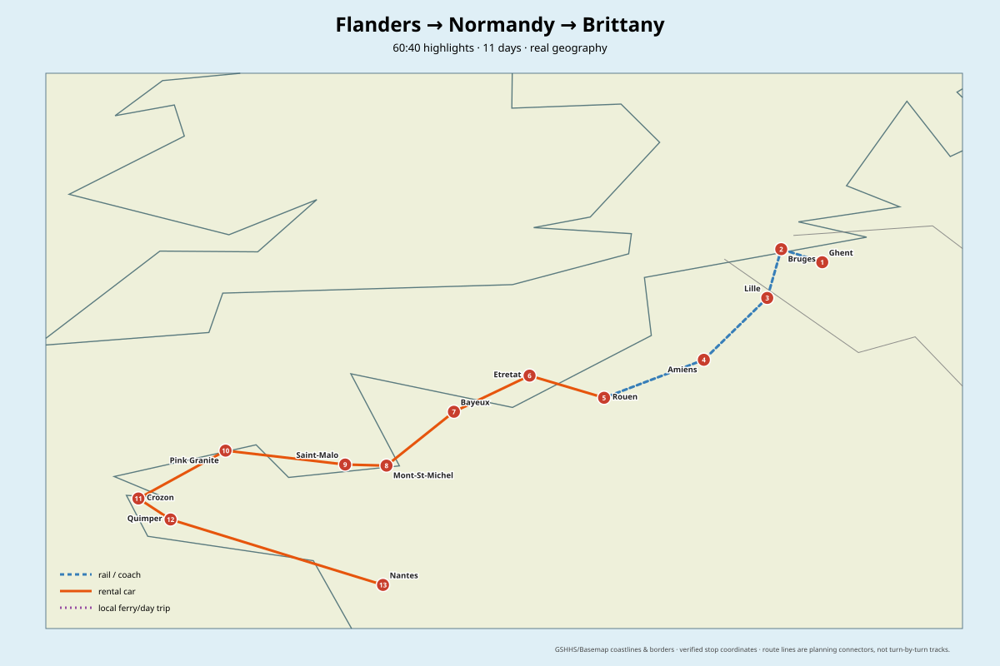

# Netherlands → Flanders → Northern France → Brittany

**Recommended length:** 28 days (fast but realistic) · 30–32 days if Maastricht/Utrecht or extra weather buffers are added  
**Best month:** September · second choice July · August good but busiest/most expensive · February only for a city-heavy budget version  
**Transport concept:** trains through NL/BE/northern France, then rental car from Rouen for Normandy/Brittany, return in Nantes  
**Research snapshot:** 2026-08-24

> You already know Amsterdam, Brussels, Antwerp and Liège, so this route deliberately does not spend scarce sightseeing days repeating them. Amsterdam/Schiphol is used as the arrival hub only.

## Optimized route

**AMS/Schiphol → Haarlem → Leiden → Delft → Rotterdam/Kinderdijk → Ghent → Bruges → Ypres → Lille → Amiens → Rouen → Étretat → Honfleur → Bayeux/D-Day coast → Mont-Saint-Michel → Saint-Malo/Dinan/Cap Fréhel → Côte de Granit Rose → Morlaix → Crozon → Brest/Pointe Saint-Mathieu → Locronan/Quimper → Carnac/Vannes → Nantes → fly home**

## Why this order wins

- It continuously moves southwest; there is almost no major backtracking.
- **Maastricht is not on the main line.** It is a worthwhile city, but it pulls the trip east and then forces you back west toward Flanders. Add it only if you extend the trip to ~30–32 days.
- Ghent + Bruges + Ypres are the strongest geographically efficient Flemish sequence for this trip. Leuven/Mechelen are good but point back toward Brussels/Antwerp, which you already know.
- Lille is a natural bridge into France. Amiens is best treated as a high-value stop on the Lille→Rouen transfer rather than another hotel move.
- From Rouen onward, a **car becomes much more valuable** than rail because Étretat, the D-Day coast, Cap Fréhel, the Pink Granite Coast, Crozon and the megalithic/coastal Brittany sights are awkward by public transport.
- **Brest is not the best place to end the trip.** The city/airport is a weak homebound hub for Austria; current schedules show no nonstop BES→VIE. Continue through southern Brittany to Nantes instead.
- Nantes is both a worthwhile final city and the best current exit strategy: Volotea currently markets a nonstop Nantes↔Vienna route. Always re-check the exact operating days before booking.

## The 28-day recommendation at a glance

| Days | Base / area | Main reason |
|---|---|---|
| 1–5 | Haarlem → Leiden → Delft/Rotterdam | compact Dutch cities + Kinderdijk, without repeating Amsterdam |
| 6–10 | Ghent → Bruges → Ypres | best-value Flanders sequence |
| 11–14 | Lille → Amiens → Rouen | French-Flemish architecture, art, Gothic core |
| 15–18 | Étretat/Honfleur → Bayeux/D-Day → Mont-Saint-Michel | Normandy's strongest cluster |
| 19–24 | Saint-Malo → Côte de Granit Rose → Crozon → Brest | fortified coast + Brittany nature |
| 25–28 | Quimper → Carnac/Vannes → Nantes | strongest south-Brittany finish + useful airport |

Detailed day-by-day plan: [general-28-day-route.md](general-28-day-route.md)

## 60:40 version

**11 days** captures roughly **~64–68% of the normalized first-trip experience value** by keeping Ghent, Bruges, Lille, Rouen/Étretat, Bayeux/D-Day, Mont-Saint-Michel, Saint-Malo/Dinan, Côte de Granit Rose and Crozon, then exiting via Nantes.

See [itinerary-60-40.md](itinerary-60-40.md).

## Month choice

For this exact mixed city + coast + hiking/road-trip itinerary:

1. **September — 9/10:** still mild, usually much less crowded than July/August, good walking temperatures, better accommodation value. Weather becomes less stable toward late September in Brittany, so keep one flexible coastal day.
2. **July — 8.5/10:** longest daylight and best odds for coastal days, but more crowds and higher prices.
3. **August — 7.5/10:** very good weather potential but peak French holiday pressure, especially Normandy/Brittany coast.
4. **February — 4.5/10:** cheap and excellent for museums/cities, but short daylight, wind/rain risk and many coastal experiences lose value.

The Netherlands' 1991–2020 September normal at De Bilt is about 14.7°C mean with ~77.9 mm precipitation; Belgian September normals are around 19.5°C average maximum and ~65 mm rain at Uccle. Brest is maritime and notably wetter/windier than the Low Countries, which is why the route needs a flexible coastal buffer even in shoulder season.

See [weather-and-timing.md](weather-and-timing.md).

## Best flight strategy

### Best total-value shell

**One-way/open-jaw:** **VIE/BUD → AMS**, then **NTE → VIE/BUD**.

- Inbound Amsterdam is easy to price-shop and avoids wasting time positioning to a smaller airport.
- Current Volotea inventory markets **Nantes ↔ Vienna nonstop**; their public offers page currently shows a promotional Nantes→Vienna fare from roughly €103, but this is not a guarantee for your dates.
- Nantes↔Budapest is also currently served nonstop by easyJet on a limited weekly schedule, which can be worth checking if the fare is much lower and the Budapest→Austria positioning is acceptable.
- **Brest→Vienna currently has no nonstop service**, so finishing in Brest usually means a connection or a 3–4 hour train repositioning first.

### Backup if NTE flight day does not fit

Return the car in Nantes, take TGV to Paris, then fly PAR→VIE. Do not redesign the whole route around a one-day airline schedule until the final dates are known.

See [flights.md](flights.md).

## Major S-tier experiences

- Bruges historic centre at dawn/evening
- Ghent: Graslei/Korenlei + Gravensteen + night waterfront
- Kinderdijk windmill landscape
- Étretat cliffs
- D-Day landing coast + Bayeux
- Mont-Saint-Michel at low-crowd hours / changing tide
- Saint-Malo walls + Dinan / Cap Fréhel
- Ploumanac'h / Côte de Granit Rose
- Crozon Peninsula coast
- Carnac megalithic landscape

Full scoring: [sights.md](sights.md) and [data/sights.csv](data/sights.csv).

## Optional extensions

- **Maastricht +2 days:** good city, poor geometry; insert after Rotterdam, then continue to Ghent.
- **Utrecht +1 day:** easier than Maastricht and a better fit if you want another Dutch city.
- **Zeeland +1–2 days:** Middelburg/Veere/Delta Works; scenic but cross-border public transport to Belgium is slower.
- **More Brittany +2–4 days:** Roscoff, Île de Batz, Concarneau, Pont-Aven, Quiberon or Belle-Île.
- **No car version:** possible, but noticeably weaker for Normandy/Brittany nature and requires more day-tour compromises.

## Files

- [28-day route](general-28-day-route.md)
- [60:40 route](itinerary-60-40.md)
- [Worked July 2027 booking example](booking-example-2027-07.md)
- [Transport optimization](transport-and-route-optimization.md)
- [Flights / homebound strategy](flights.md)
- [Sight scoring](sights.md)
- [Weather / timing](weather-and-timing.md)
- [Variants](optional-variants.md)
- [Sources](sources.md)
- [Full SVG map](maps/map-full-route.svg)
- [60:40 SVG map](maps/map-60-40-route.svg)
- [GeoJSON stops](maps/stops.geojson)
- [Full route GeoJSON](maps/route.geojson)
- [60:40 GeoJSON](maps/route-60-40.geojson)
- [Interactive map](maps/interactive-map.html)

## Map method

The static maps are generated from explicit geographic coordinates stored in `maps/stops.geojson`. Coastlines and borders come from Basemap/GSHHS via the repository-wide `tools/python/script.py`. Route segments are **planning connectors** with transport-mode semantics, not fake turn-by-turn road traces; the source GeoJSON is committed beside the SVG so the map remains auditable and reproducible.
