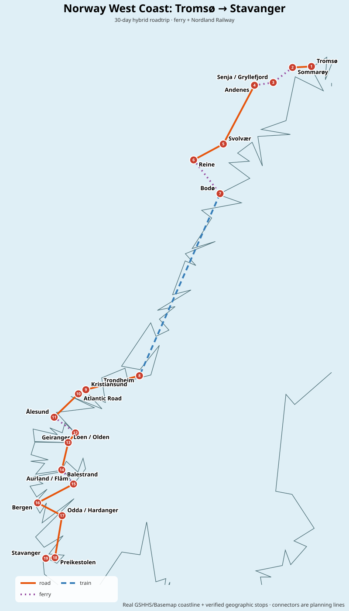
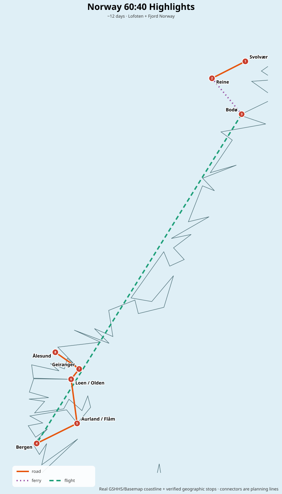

# Norway West Coast — Tromsø → Stavanger

**Recommended format:** ~30 days, **hybrid roadtrip + ferry + daytime Nordland Railway**, north → south in July/August.  
**Best overall month:** August. **Best pure weather/open-road month:** July. **September:** reverse the route (south → north).

## Route in one line

**Tromsø → Sommarøy → Senja → Andenes → Lofoten → Bodø → _Nordland Railway_ → Trondheim → Kristiansund → Atlantic Road → Ålesund → Geiranger → Gamle Strynefjellsvegen → Loen/Olden → Balestrand → Aurland/Flåm → Bergen → Hardanger/Odda → Ryfylke → Preikestolen → Stavanger**

## Why this version wins

The tempting plan is one rental car from Tromsø all the way to Stavanger. I would **not** make that the default. The Bodø–Trondheim connection is almost 600 km by road and the official Nordland Railway itself is a sightseeing experience: 729 km, roughly 10 hours, crossing the Arctic Circle. Splitting the rental into **Tromsø→Bodø** and **Trondheim→Stavanger** usually gives better sightseeing-value per day and avoids keeping an expensive rental car for a long inter-regional transfer.

The route also uses the seasonal **Gryllefjord–Andenes ferry** to connect Senja and Vesterålen efficiently, the **Moskenes–Bodø ferry** to exit Lofoten, and does **not rely on Trollstigen**, because the road has had rockfall-related closures. Re-check it for the travel year.

## 30-day structure

| Days | Area | Core experiences |
|---|---|---|
| 1–2 | Tromsø / Kvaløya | Arctic city, Sommarøy, coastal scenery |
| 3–4 | Senja | Scenic Route Senja, Tungeneset/Bergsbotn, Hesten/Segla views |
| 5–6 | Andøya / Vesterålen | seasonal ferry, Andenes, Bleik coast |
| 7–10 | Lofoten | Henningsvær, Nusfjord, Reine/Hamnøy, Å, hikes/weather buffer |
| 11–12 | Bodø | ferry from Moskenes, Saltstraumen |
| 13 | Bodø → Trondheim | **daytime Nordland Railway** |
| 14 | Trondheim | Nidaros / Bakklandet, recovery |
| 15–17 | Northwest | Kristiansund, Atlantic Road, Ålesund/Sunnmøre |
| 18–21 | Geiranger / Nordfjord | Geirangerfjord, Dalsnibba, old Strynefjell road, Loen/Olden |
| 22–25 | Sognefjord | Fjærland/Balestrand, Gaularfjellet, Aurlandsfjellet, Flåm |
| 26–27 | Bergen | Bryggen, Fløyen/Ulriken, weather buffer |
| 28 | Hardanger | waterfalls, fjord road, Odda |
| 29–30 | Ryfylke / Stavanger | Ryfylke road, Preikestolen, Stavanger |

## 60:40 version

About **12 days**: **Lofoten (4) → ferry to Bodø → strategic flight to Bergen → Aurland/Flåm → Loen → Geiranger → Ålesund**. This keeps the most distinctive mountain-meets-sea and fjord scenery while sacrificing Tromsø, Senja, Trondheim, Atlantic Road, Hardanger and Stavanger.

## Month choice

- **August — 9.6/10:** best balance of open roads, hiking, long daylight and slightly less peak-season pressure than July.
- **July — 9.4/10:** best for maximum daylight and seasonal reliability; busiest and usually most expensive.
- **September — 8.2/10:** gorgeous autumn light, fewer crowds and northern-lights potential, but more weather/closure risk. **Reverse to Stavanger → Tromsø** so high mountain roads happen early in the month.

## Important live checks before booking

1. **Gryllefjord–Andenes ferry** — seasonal; 2026 operation ended 27 September.
2. **Nordland Railway** — daytime journey is ideal, but 2026 had disruption/replacement buses and the night train was cancelled until further notice.
3. **Trollstigen** — do not make the itinerary dependent on it; rockfall closures have occurred.
4. **Gamle Strynefjellsvegen** — winter-closed; historical closure can occur from mid-September.
5. Car-rental **one-way fees** can change the optimal split; quote both the hybrid and single-car versions before paying.

## Camping / sleeping in the car

Norway's right to roam applies to people, **not unrestricted vehicle parking**. Cars/campervans may park only where road/parking rules allow; stay away from homes/cabins, farmland and signed no-overnight areas. Lofoten/Senja are especially sensitive, so use designated camping/parking when possible.

## Files

- [Detailed 30-day itinerary](itinerary-30-days.md)
- [60:40 highlights route](itinerary-60-40.md)
- [Transport + route optimization](transport-and-route-optimization.md)
- [Flights](flights.md)
- [Sights ranking](sights.md)
- [Weather + timing](weather-and-timing.md)
- [Optional variants](optional-variants.md)
- [August 2027 booking example](booking-example-2027-08.md)
- [Sources](sources.md)
- [Interactive map](maps/interactive-map.html)
- [Machine-readable sights](data/sights.csv)

## Map method

`maps/stops.geojson` is the source of truth for stop positions. The SVG uses **real GSHHS coastline/border data** via the repository's `tools/python/script.py` workflow. Route segments are mode-aware planning connectors (road / train / ferry / flight) unless exact routing geometry is later supplied.
