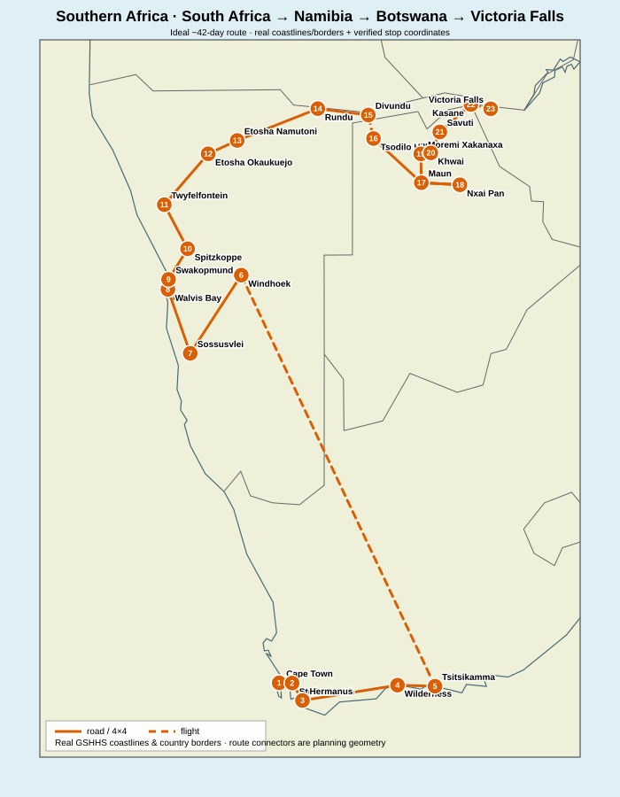
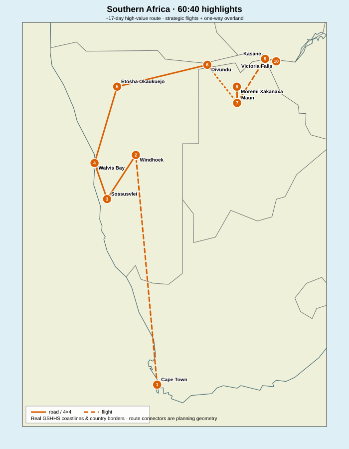

# Southern Africa — South Africa → Namibia → Botswana → Victoria Falls

Route-optimized research for a first trip through **South Africa, Namibia, Botswana and Victoria Falls**, designed from the repository master prompt around **sightseeing value + route efficiency + cost + weather + uniqueness + fatigue**.

Research snapshot: **2026-08-23**.

> This is an evergreen planning route rather than a booking quote. Park rules, road conditions, border procedures, campsites, flights, vehicle one-way policies and Victoria Falls water levels change; recheck before booking.

## The route decision in one sentence

**Cape Town / Western Cape → Garden Route → fly to Windhoek → Sossusvlei → Atlantic desert coast → Damaraland → Etosha → Kavango → cross Namibia→Botswana at Mohembo → Maun / Okavango → Moremi → Khwai → Savuti → Kasane / Chobe → return 4×4 → shuttle to Victoria Falls → fly home.**

The key optimization is the **Mohembo crossing** after Divundu. It enters Botswana from the west, so the safari section moves almost continuously **west → east** through Maun, Moremi, Khwai and Savuti to Kasane. That avoids the common but inefficient pattern of reaching Kasane first, backtracking to Maun/Okavango, and then returning to Kasane for Victoria Falls.

## Recommended duration

| Version | Time | Verdict |
|---|---:|---|
| **Ideal first trip** | **~42 days / 6 weeks** | Best balance; includes Garden Route, Damaraland, Nxai Pan and the full Moremi→Khwai→Savuti traverse. |
| **Strong compressed version** | **28 days** | Excellent; protects nearly all S-tier experiences but cuts repeat/low-efficiency stops. |
| **60:40 highlights** | **~17 days** | Uses strategic flights/guided safari to preserve roughly **68% of normalized experience value in ~40% of the ideal-trip time**. |
| < 14 days | Not recommended for all four areas | Choose either Cape + Namibia or Botswana + Victoria Falls instead. |

## Real geographic maps

These maps are **programmatically rendered from geographic coordinates and real GSHHS coastlines/country borders**, not AI-generated geography. Route lines are planning connectors unless a routed road geometry is explicitly available.

Map data: [`maps/stops.geojson`](./maps/stops.geojson), [`maps/route.geojson`](./maps/route.geojson), [`maps/route-60-40.geojson`](./maps/route-60-40.geojson). Interactive OSM-backed view: [`maps/interactive-map.html`](./maps/interactive-map.html).

## Ideal ~42-day route

| Days | Base / move | Core experience |
|---|---|---|
| 1–5 | Cape Town + Winelands | Table Mountain/Lion's Head, Cape Peninsula, Boulders, Cape Point, Kirstenbosch, Stellenbosch |
| 6–9 | Garden Route | Hermanus if seasonal, Wilderness/Knysna, Tsitsikamma hiking; then fly to Windhoek |
| 10–15 | Namib Desert + coast | Windhoek logistics, Sossusvlei/Deadvlei, Walvis Bay/Sandwich Harbour, Swakopmund |
| 16–18 | Spitzkoppe + Damaraland | granite landscapes, Twyfelfontein, desert-adapted wildlife |
| 19–22 | Etosha | multi-day west/central/east self-drive safari |
| 23–27 | Kavango → Botswana west | Rundu, Divundu/Mahango, Mohembo border, Tsodilo Hills, Maun |
| 28–31 | Delta + pans | Okavango mokoro/boat/scenic flight, Nxai Pan/Baines' Baobabs |
| 32–38 | wilderness 4×4 traverse | Moremi → Khwai → Savuti → Kasane |
| 39 | Chobe | morning game drive + afternoon/sunset river safari |
| 40–42 | Victoria Falls | shuttle from Kasane, Zimbabwe viewpoints, optional Zambia side/Devil's Pool when open, fly out VFA |

Detailed daily plan: [`ideal-42-day-route.md`](./ideal-42-day-route.md).

## 28-day first-trip route

**Cape Town 4d → fly Windhoek → Sossusvlei 2d → Sandwich Harbour/Swakop → Spitzkoppe → Twyfelfontein → Etosha 3d → Rundu/Divundu/Mahango → Mohembo → Maun/Okavango → Moremi → Khwai → Savuti → Chobe → Victoria Falls.**

The 28-day version deliberately cuts the **Garden Route, Nxai/Makgadikgadi and extra buffer days** rather than cutting Okavango/Moremi, Sossusvlei, Etosha, Chobe or Victoria Falls.

See [`general-28-day-route.md`](./general-28-day-route.md) and [`itinerary-28-days.md`](./itinerary-28-days.md).

## 60:40 route — ~17 days

**Cape Town → fly Windhoek → Sossusvlei → Sandwich Harbour → Etosha → Divundu/Mahango → Maun/Okavango → Moremi → fly Maun→Kasane → Chobe → Victoria Falls.**

This version buys back time with two strategic air legs and avoids the roughest multi-day 4×4 chain. It keeps the experiences that are most difficult to substitute elsewhere.

See [`itinerary-60-40.md`](./itinerary-60-40.md).

## Highest-value experiences

1. **Okavango Delta + Moremi — 10/10**
2. **Sossusvlei + Deadvlei + Big Daddy — 10/10**
3. **Victoria Falls — 10/10**
4. **Table Mountain + Lion's Head — 9.8/10**
5. **Chobe River safari — 9.7/10**
6. **Etosha — 9.6/10**
7. **Sandwich Harbour — 9.5/10**
8. **Cape Peninsula — 9.5/10**
9. **Khwai — 9.3/10**
10. **Savuti — 9.2/10**

Normalized sight data: [`data/sights.csv`](./data/sights.csv). Full ranking and cut logic: [`sights.md`](./sights.md).

## Best season

For the **whole route**, the strongest overall compromise is **late August to September**: Namibia and Botswana are deep in the dry safari season, remote tracks are normally more predictable than in the rains, and Cape Town is moving into spring. The trade-off is lower Victoria Falls flow than March–June.

If the **waterfall itself is a top-3 priority**, prefer **June–July**: still excellent safari timing, but materially more water at Victoria Falls. Zambia Tourism identifies **March–June** as the prime flood season; low-water activities such as Devil's Pool are normally seasonal and depend on official opening conditions.

See [`weather-and-timing.md`](./weather-and-timing.md).

## Transport choices that save the most time

- **Fly South Africa → Windhoek.** Cape Town→Windhoek is roughly 3.5 h by air in Rome2Rio's route overview versus about 14 h driving or ~23 h bus.
- **Use a Namibia/Botswana-capable 4×4 one-way**, ideally Windhoek→Kasane if the rental company permits it.
- **Cross at Mohembo** instead of going all the way east through the Zambezi Region to Kasane first.
- **Return the vehicle in Kasane and shuttle to Victoria Falls** unless a Zimbabwe cross-border vehicle permit/fee structure is unusually favorable.
- **Fly home from Victoria Falls (VFA)** or position to Johannesburg only if the long-haul fare saving exceeds the extra flight, baggage, buffer and lost time.

Full transport analysis: [`transport-and-route-optimization.md`](./transport-and-route-optimization.md).

## Flight strategy

Because no exact travel dates were supplied, the route does **not** pretend to have a definitive cheapest ticket. The current structural favorite is an **open-jaw**:

**Europe → Cape Town (CPT)** / **Victoria Falls (VFA) → Europe**, with **Cape Town → Windhoek (WDH)** as the strategic regional flight.

As a market snapshot only, Skyscanner returned **VIE→CPT from about €600 one-way for July 2027**, while VIE→JNB appeared from about €516 and BUD→JNB about €515. The Johannesburg saving is not automatically better because it adds a ~2h48 Cape Town positioning flight plus connection/baggage risk. No usable VFA→VIE/BUD indicative quote was returned in the same snapshot, so no full-trip “winner” is claimed.

Details: [`flights.md`](./flights.md).

## What is deliberately *not* on the core route

- **Kruger** — excellent, but duplicates safari time and creates a large geographic detour when the trip already contains Etosha + Okavango/Moremi + Chobe.
- **Fish River Canyon / Lüderitz / Kolmanskop** — strong Namibia sights, but pull the route far south before it must turn north for Botswana.
- **Kgalagadi** — superb but geographically wrong for this first-trip northbound arc.
- **Johannesburg** — useful air hub, not required sightseeing on this nature-heavy route.
- **Makgadikgadi** — good optional 42+ day extension; Nxai gives a cleaner first taste of pans/baobabs from Maun.

## Repository files

- [`ideal-42-day-route.md`](./ideal-42-day-route.md)
- [`general-28-day-route.md`](./general-28-day-route.md)
- [`itinerary-28-days.md`](./itinerary-28-days.md)
- [`itinerary-60-40.md`](./itinerary-60-40.md)
- [`transport-and-route-optimization.md`](./transport-and-route-optimization.md)
- [`flights.md`](./flights.md)
- [`sights.md`](./sights.md)
- [`weather-and-timing.md`](./weather-and-timing.md)
- [`optional-variants.md`](./optional-variants.md)
- [`sources.md`](./sources.md)
- [`data/sights.csv`](./data/sights.csv)
- [`maps/`](./maps/)

No `booking-example-YYYY-MM.md` or dated `itinerary.md` is created because **no travel period was supplied**. That avoids mixing temporary fares with the evergreen route; add the dated layer once dates are known.