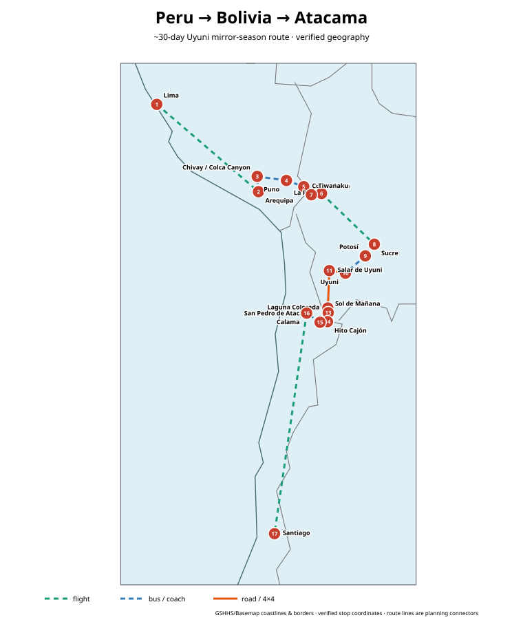
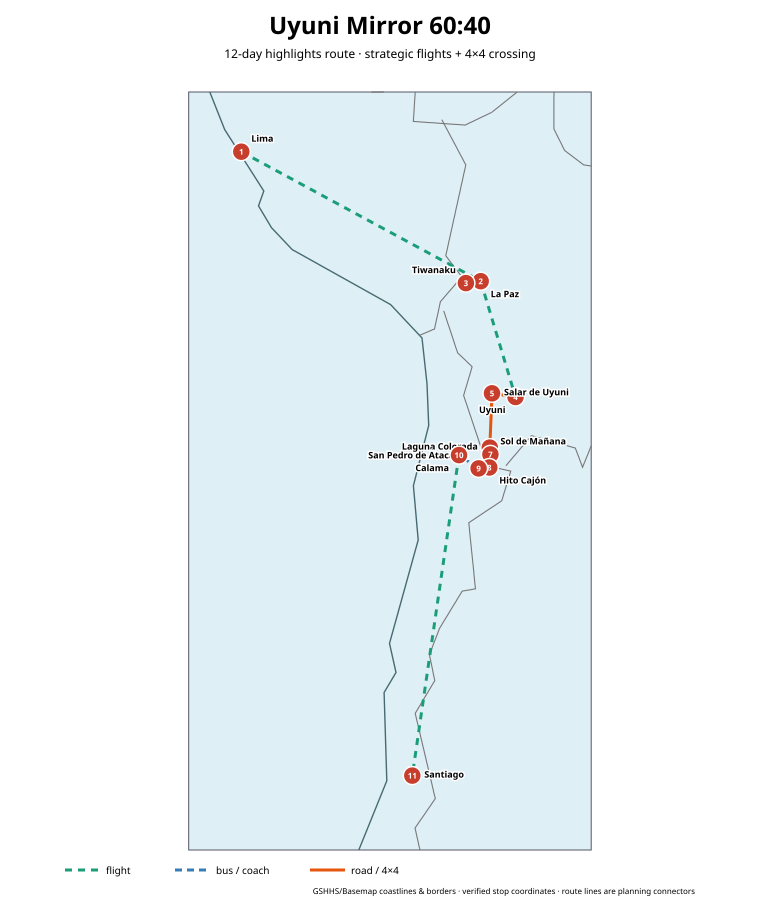

# Uyuni mirror season: Peru → Bolivia → Atacama

**Recommended length:** 30 days  
**Best timing for this exact goal:** **early February → early March**, with Uyuni around the third week of February.  
**Best pure mirror month:** **February**.  
**Best reliability/mirror compromise:** **late February to early March**, accepting that standing water is never guaranteed.  
**Route concept:** cheap international gateway in Peru → gradual altitude gain → Bolivia highlights → dedicated Uyuni mirror day → 3-day Sur Lípez crossing → San Pedro de Atacama → cheap domestic flight to Santiago → open-jaw flight home.

## Optimized route

**Fly into Lima → fly to Arequipa → Colca Canyon/Chivay → Puno → Copacabana → La Paz + Tiwanaku → fly to Sucre → Potosí → Uyuni → dedicated Salar mirror day → 3-day Eduardo Avaroa / Sur Lípez 4×4 crossing → San Pedro de Atacama → Calama → fly Santiago → fly home.**

This order is deliberately not a Bolivia-only loop. Lima and Santiago are much stronger international fare markets than Uyuni/La Paz, while the route itself keeps moving southeast with almost no major backtracking. It also acclimatizes progressively before the 4,500–4,900 m Sur Lípez section.

## Why this order wins

1. **Mirror timing:** a 2025 satellite-radar study found the Salar's smooth-surface peak from late January to early March, with the highest observed chance in late February; the worked example therefore places the Salar on days 19–23 and gives Uyuni dedicated flexibility.
2. **Altitude:** Lima → Arequipa (~2,300 m) → Titicaca/La Paz (~3,650–3,850 m) → Potosí/Uyuni (~3,650–4,100 m) is much safer and more comfortable than flying straight into La Paz and immediately taking a high-altitude 4×4 tour.
3. **No ugly return to Uyuni:** the 3-day expedition ends at Hito Cajón/San Pedro rather than driving back north.
4. **Cheap airport shells:** current fare snapshots show Lima and Santiago materially more competitive than Bolivia's international airports. Vienna–Lima return is currently advertised from roughly €760 on Skyscanner, while Vienna–Santa Cruz is roughly €956+; Budapest–Santiago is currently around €817 return. These are indicative snapshots, not guaranteed open-jaw prices.
5. **Safety/time:** the route uses a strategic La Paz→Sucre flight when schedules/prices are reasonable instead of relying on a night bus; Austria's BMEIA currently advises against night overland buses in Bolivia.

## 30-day split

| Segment | Days | Main value |
|---|---:|---|
| Lima | 2 | cheap gateway, historic centre + coast/food |
| Arequipa + Colca | 5 | acclimatization, volcano scenery, canyon/condors |
| Titicaca | 3 | Puno/Taquile, Copacabana, Isla del Sol |
| La Paz + Tiwanaku | 4 | cable cars, markets, archaeology, acclimatization |
| Sucre + Potosí | 5 | strongest colonial/history cluster |
| Uyuni + Sur Lípez crossing | 5 | mirror day + salt flat + lagoons + geysers + border crossing |
| San Pedro de Atacama | 4 | Valle de la Luna, Tatio, Piedras Rojas/lagunas, astronomy |
| Santiago / departure | 2 | buffer + international departure |

## Mirror-season strategy

The famous mirror requires **recent rain + shallow standing water + low wind**; rainy season alone is not a guarantee. The 2025 *Communications Earth & Environment* satellite-radar study found the smooth-surface peak from **late January through early March** and about **50% radar-smooth observations in late February** in its analysis. Specialist on-the-ground guidance agrees that these same wet conditions can restrict Isla Incahuasi access or alter the Sur Lípez route.

Therefore this itinerary intentionally gives Uyuni:

- one arrival/scouting afternoon;
- one **dedicated full mirror day** including sunset and optional star/sunrise session;
- the separate 3-day crossing;
- no same-day international connection after Hito Cajón.

If the Hito Cajón route closes temporarily, use the contingency in `safety-and-borders.md` rather than forcing a connection.

## 60:40 route

**12 days:** Lima gateway → fly La Paz → Tiwanaku → fly La Paz–Uyuni → mirror day → 3-day Sur Lípez crossing → San Pedro de Atacama → Calama flight → Santiago.

It preserves roughly **65–70% of the normalized first-trip experience score** because the salt-flat/mirror + Eduardo Avaroa + Atacama cluster is exceptionally high-value per day, while Colca, Titicaca, Sucre and Potosí are excellent but geographically/time-expensive in a 12-day trip.

## Best flight strategy

### Raw cheapest airfare anchors

Research snapshot: **27 Aug 2026**.

- VIE↔LIM: Skyscanner currently shows returns from about **€760**, with February identified as the cheapest month.
- BUD↔LIM: around **€845** return in current Skyscanner region results; February cheapest.
- BUD↔SCL: around **€817** return for some February 2027 dates.
- VIE↔VVI (Santa Cruz): around **€956+** return; usually weaker than Lima/Santiago gateways.
- Madrid–Santa Cruz has nonstop service on Air Europa and BoA, so a separate VIE/BUD→MAD positioning strategy is worth checking if open-jaw pricing is poor.

### Best total-value strategy

First search **VIE/BUD → LIM // SCL → VIE/BUD** as one multi-city/open-jaw ticket. If that costs no more than about **€150–250 above** a Lima round trip, it is usually the best-value choice because it avoids a long repositioning flight/overland return and protects 1–2 sightseeing days.

If the open-jaw quote is bad, compare:

1. BUD↔SCL round trip + internal positioning;
2. VIE↔LIM round trip + SCL→LIM positioning flight;
3. VIE/BUD→MAD + MAD↔VVI direct as a Bolivia-heavy budget variant.

See `flights.md` for the dated fare layer.

## Current safety note

As of 12 Aug 2026, Austria's BMEIA rates **La Paz/El Alto, Cochabamba and Santa Cruz areas at level 3 (high security risk)** and the rest of Bolivia at level 2. It specifically notes protests/roadblocks, robberies and advises against night overland bus travel. This is not a reason to delete La Paz automatically, but it changes how the route should be executed: licensed tours, official taxis, daytime transfers where practical, and a live roadblock/safety check before every long Bolivian leg.

## Files

- [General 30-day route](general-28-day-route.md)
- [Detailed 30-day itinerary](itinerary-28-days.md)
- [12-day 60:40 route](itinerary-60-40.md)
- [Worked February 2027 booking example](booking-example-2027-02.md)
- [Transport and route optimization](transport-and-route-optimization.md)
- [Flight research](flights.md)
- [Sights ranking](sights.md)
- [Weather and timing](weather-and-timing.md)
- [Safety and borders](safety-and-borders.md)
- [Optional variants](optional-variants.md)
- [Sources](sources.md)
- [Machine-readable sight data](data/sights.csv)
- [Interactive map](maps/interactive-map.html)
- [GeoJSON stops](maps/stops.geojson)
- [Full route GeoJSON](maps/route.geojson)

## Map method

Stops are stored in GeoJSON as `[longitude, latitude]` and cross-checked against UNESCO, Wikidata/GeoNames and OpenStreetMap-derived references where practical. The source data is compatible with the repository-wide `tools/python/script.py` Basemap/GSHHS renderer; the committed SVGs are compact GSHHS/Basemap real-geography renderings of the same verified stop and route data. Route lines are **planning connectors** with explicit mode semantics, not fake turn-by-turn roads. Both full and 60:40 SVG files are committed in this folder.
